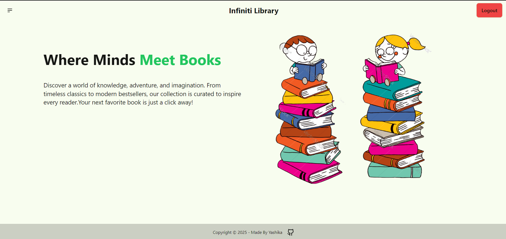
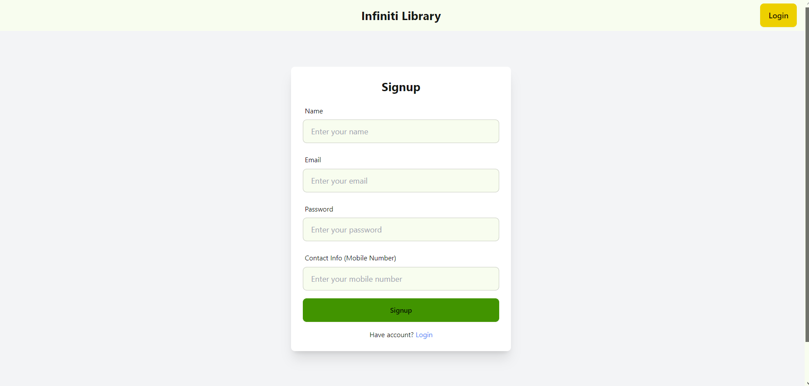
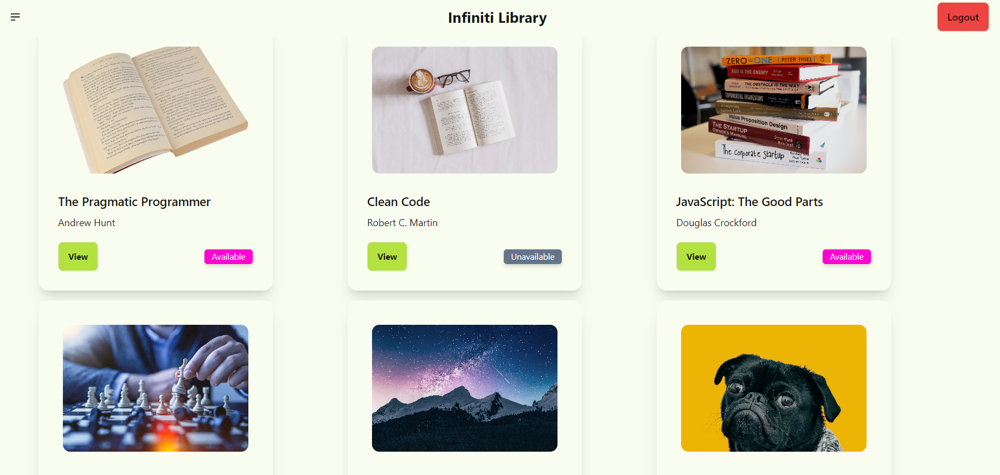
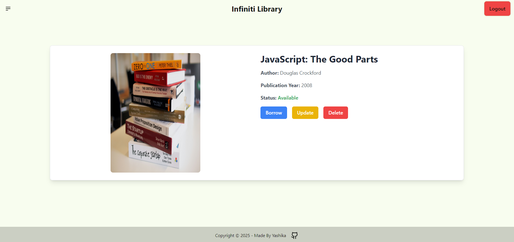
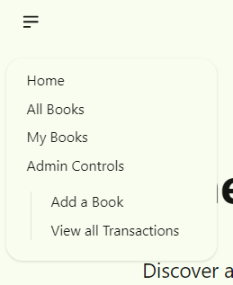
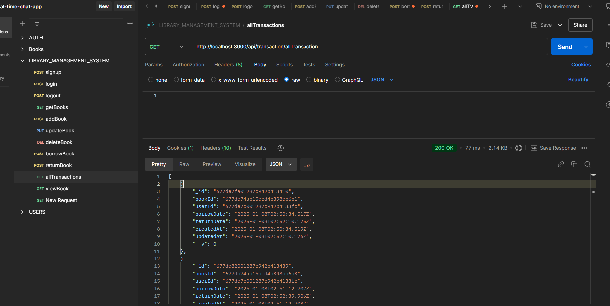

# 📚 Infiniti Library

An online library management application built with the **MERN stack** (MongoDB, Express.js, React.js, Node.js) that allows users to browse, search, and manage books. The project emphasizes secure authentication, smooth UI interactions, and efficient state management.

---

## 🌐 Live Demo
You can view the live version of the **Infiniti Library** here:
👉 [Live Website](https://library-management-system-7vtt.onrender.com/)

---

## 🚀 Technologies Used

- **MongoDB**: NoSQL database for flexible and scalable data storage.
- **Express.js**: Backend framework to handle API requests.
- **React.js**: Frontend library for building dynamic user interfaces.
- **Node.js**: JavaScript runtime for server-side scripting.
- **Tailwind CSS**: Utility-first CSS framework for rapid UI design.
- **Daisy UI**: Pre-built UI components for consistent design.
- **bcrypt**: Password hashing for secure authentication.
- **Hot Toast**: Notifications for user feedback.
- **Zustand**: State management library for managing global state efficiently.
- **Postman**: Extensively used to test and verify the functionality of APIs.

---

## 🛠️ Project Structure

```
📂 InfinitiLibrary
├── 📁 backend
│   ├── 📄 index.js        # Entry point for backend server
│   ├── 📁 src
│   │   ├── 📁 controllers # Logic for handling requests
│   │   ├── 📁 lib         # Utility functions
│   │   ├── 📁 middleware  # Authentication and authorization
│   │   ├── 📁 models      # Mongoose schemas for data models
│   │   ├── 📁 routes      # API routes for book and user management
│   │   ├── 📁 seed        # Seed data for testing
│
├── 📁 frontend
│   ├── 📁 public         # Static public assets
│   ├── 📁 src
│   │   ├── 📁 assets     # Static assets (images, fonts, etc.)
│   │   ├── 📁 components # Reusable React components
│   │   ├── 📁 lib        # Utility functions
│   │   ├── 📁 pages      # Application pages (Home, Login, Dashboard, etc.)
│   │   ├── 📁 store      # State management with Zustand
│   │   ├── 📄 App.jsx    # Main application component
│   │   ├── 📄 index.css  # Global styles
│   │   ├── 📄 main.jsx   # React entry point
│
├── 📄 .env               # Environment variables
├── 📄 README.md          # Documentation
├── 📄 package.json       # Project dependencies
└── 📄 package-lock.json  # Dependency lockfile
```

---

## 📝 Environment Variables

Create a `.env` file in the backend root and add the following configuration:
```env
PORT=3000
MONGODB_PASSWORD=your_mongodb_password
MONGODB_URI=your_mongodb_uri
JWT_SECRET=your_jwt_secret
CLOUDINARY_CLOUD_NAME=your_cloudinary_cloud_name
CLOUDINARY_API_KEY=your_cloudinary_api_key
CLOUDINARY_API_SECRET=your_cloudinary_api_secret
NODE_ENV=development
```
Replace the placeholders with your actual credentials.

---

## 📝 Installation and Setup

Follow the steps below to run the project locally:

### 📦 Backend Setup
1. Navigate to the backend folder:
   ```bash
   cd backend
   ```
2. Install dependencies:
   ```bash
   npm install
   ```
3. Start the backend server:
   ```bash
   npm run start
   ```
4. Seed the database with books:
   ```bash
   cd ./backend
   npm run seed:books
   ```

### 💻 Frontend Setup
1. Navigate to the frontend folder:
   ```bash
   cd frontend
   ```
2. Install dependencies:
   ```bash
   npm install
   ```
3. Start the frontend server:
   ```bash
   npm run dev
   ```

4. Open your browser and visit:
   ```
   http://localhost:5173
   ```

---

## 🔑 Features
- **Frontend:**
   - Built with **React.js**.
   - Pages for adding new books, listing all books, and borrowing/returning books by users.
- **Backend:**
   - Built with **Express.js**.
   - API endpoints for CRUD operations on books, borrowing/returning functionality, and listing books by availability.
- **Database:**
   - **MongoDB** is used for data storage.
   - Collections include:
     - **Books:** title, author, publication year, availability status.
     - **Users:** name, contact info.
     - **Transactions:** book ID, user ID, borrow/return date.
- **User Authentication:** Secure login and registrations.
- **Authorization Levels:** Two levels of authorization - **User** and **Admin**.
   - **User:** View and borrow books.
   - **Admin:** Manage books and view transaction history.
- **State Management with Zustand:** Efficient and lightweight state management.
- **Responsive UI:** Tailwind CSS to ensures a clean and responsive design.
- **Real-time Updates:** Immediate feedback with Hot Toast.
- **API Verification with Postman:** Extensive testing and the verification of API endpoints.

---

## 📸 Screenshots

### 📷 Home Page


### 📷 Login Page


### 📷 All Books Page


### 📷 View Book Page


### 📷 Admin Dashboard


### 📷 Postman API Testing


---

## 🎥 Video Demonstration
Watch the full project demonstration here:
[Watch on YouTube](https://youtu.be/6Fr8ELTGnEc)
---

## 🤝 Contribution
Contributions are welcome! Fork this repository and submit a pull request with your improvements.

---

## 🛡️ License
This project is licensed under the **MIT License**.

---

### 📧 Contact
For any queries, feel free to reach out:
- **Email:** kumariyashika78@gmail.com
- **GitHub:** [Yashika118](https://github.com/Yashika118)

Happy Coding! 🚀✨
